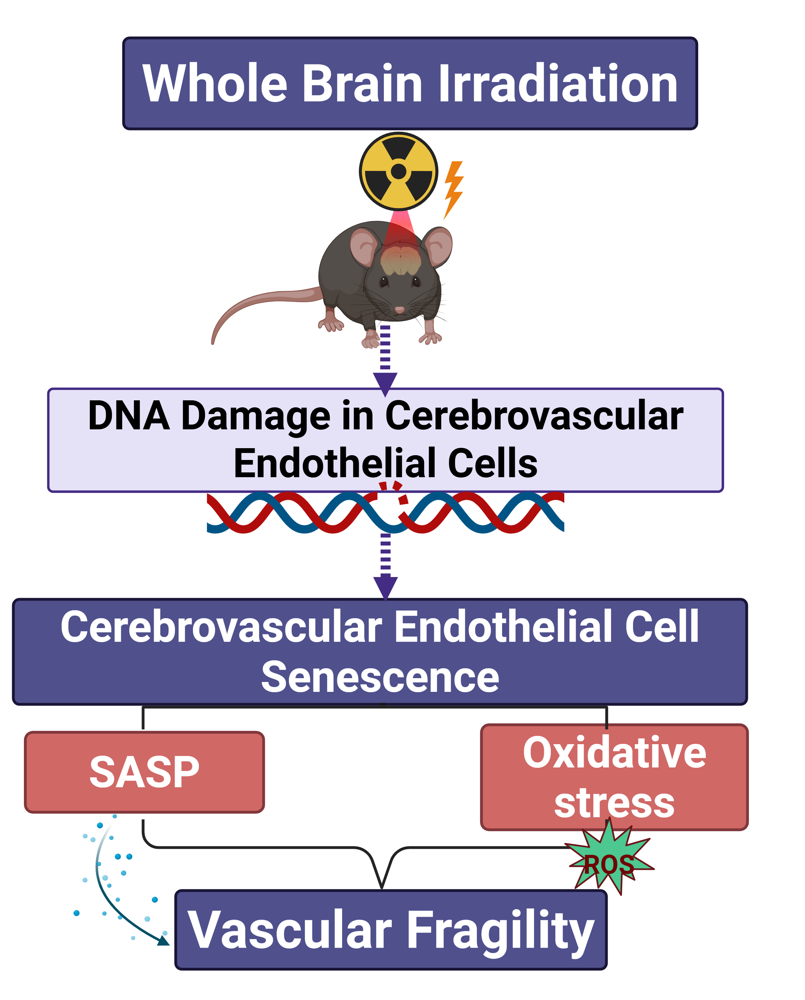
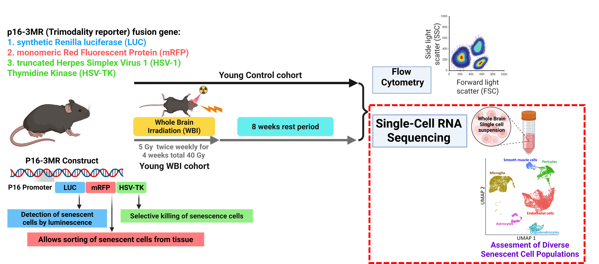

## On This Page

- [The Problem: Why Brain Radiation Causes Cognitive Decline](#introduction)
- [Hypothesis: WBI-Induced Endothelial Senescence Drives Vascular Fragility](#hypothesis)
- [Why Focus on Endothelial Cells?](#endothelial-focus)
- [Data Acquisition: From Sequencer to R](#data-loading)
- [Quality Control: Separating Signal from Noise](#qc)
- [First Look at the Data: Cell Type Composition](#cell-abundance)
- [The Analysis: Finding Senescent Endothelial Cells](#senescence-analysis)
- [Results: Radiation Effects on Endothelial Subtypes](#results)
- [What This Means: Accelerated Vascular Aging](#conclusion)

## The Problem: Why Brain Radiation Causes Cognitive Decline {#introduction}

Whole brain irradiation (WBI) is a standard treatment for patients with multiple brain metastases. Despite its clinical value, *about 50% of long-term survivors develop progressive neurocognitive decline that severely reduces quality of life*.

## Hypothesis: WBI-Induced Endothelial Senescence Drives Vascular Fragility {#hypothesis}

Growing preclinical evidence points to radiation-induced cerebrovascular injury as a central driver of this decline. Here, we test the hypothesis that **WBI-induced endothelial senescence promotes cerebrovascular fragility**, leading to cerebral microhemorrhages (CMHs) that mimic accelerated vascular aging.
```{r wbi-hypothesis-figure, echo=FALSE, fig.align="center", out.width="65%", fig.cap="Proposed mechanism linking whole-brain irradiation to cerebrovascular fragility. Radiation-induced DNA damage promotes endothelial cell senescence, which may increase SASP signaling and oxidative stress, ultimately weakening the cerebral vasculature."}

```

## Why Focus on Endothelial Cells? {#endothelial-focus}

Endothelial cells are a key part of the neurovascular unit and are essential for maintaining blood-brain barrier integrity, regulating cerebral blood flow, and preserving normal brain function. Because of these roles, endothelial injury may be one of the main ways that whole brain irradiation leads to long-term cerebrovascular dysfunction and cognitive decline.

This focus is supported by our lab’s previous work showing that **WBI induces endothelial dysfunction in the mouse brain and produces an accelerated vascular aging-like phenotype**. In addition, senolytic treatment with Navitoclax/ABT263 has been shown to reduce WBI-induced blood-brain barrier disruption, further suggesting that senescent endothelial cells may play an important role in radiation-related brain injury [1-3].

## Experimental Design

- **Subjects:** Young mice  
- **Treatment:** Fractionated Whole-Brain X-ray Irradiation (WBI) at a clinically relevant dose of 5 Gy twice                   weekly for four weeks, for a total dose of 40 Gy  
- **Timepoint:** Two months post-treatment; FACS and scRNA-seq readouts   
- **Method:** 10x Genomics Chromium Single Cell 3′ Gene Expression

Figure 1 summarizes the experimental design, including the p16-3MR reporter system, irradiation protocol, cell sorting, and single-cell RNA-sequencing workflow.

<div class="wide-figure">

```{r experimental-design-figure, echo=FALSE, fig.align="center", out.width="100%", fig.cap="Experimental design for evaluating whole-brain irradiation-induced cellular senescence. Young p16-3MR mice underwent fractionated WBI followed by a two-month recovery period, FACS, and single-cell RNA sequencing."}

```

<p class="full-image-link">
  <a href="images/fig_gif.gif" target="_blank">
    Open figure at full size
  </a>
</p>

</div>

## Data Acquisition: From Sequencer to R {#data-loading}

### Load the annotated count matrix

```{r}
data.table <- read.csv("C:/Users/SCHANDR5/OneDrive - University of Oklahoma/Documents/Github drive/sivasaichandragiri.github.io/projects/WBI_all_annot_v0_obs_for Final Assisgment.csv")
```

## Quality Control: Separating Signal from Noise {#qc was checked before}

### Sample Selection and Filtering

```{r}
library(tidyverse)
library(ggplot2)
glimpse(data.table)

#creating a vector of the sample_ids I wan to extract 
target_ids = c("CA1", "CA2", "CA3", "CA4", "WBI-1", "WBI-2", "WBI-3", "WBI-4")

# Filter to samples of interest
filterd_ids = data.table |>
  filter(sampleid %in% target_ids)
unique_count <- n_distinct(filterd_ids$sampleid)
unique_count

write.csv(filterd_ids, file = "output.csv")

```

## First Look at the Data: Cell Type Composition {#cell-abundance}

### Calculating Cell Type Abundance

```{r}
# Calculate percentage abundance

celltype_abundance_wide <- table(
  filterd_ids$celltype,
  filterd_ids$sampleid
) |>
  prop.table(margin = 2) |>
  (\(x) x * 100)() |>
  as.data.frame.matrix() |>
  rownames_to_column("celltype")

glimpse(celltype_abundance_wide)

# my_cols = c("celltypes", )

# Convert to long format for plotting

celltype_abundance_long <- celltype_abundance_wide %>%
  pivot_longer(cols = -celltype, names_to = "sample", values_to = "abudance")

glimpse(celltype_abundance_long)

```

# Creating visualization
```{r}
ggplot(celltype_abundance_long, aes (x = sample, y = abudance, fill = celltype)) + geom_bar(stat = "identity") + scale_y_continuous(limits = c(0, 100), breaks = seq(0, 100, 10)) + theme_classic() + labs(subtitle = "Cell type abundance across control and WBI-treated samples", x = "sample", y = "Cell Type Abundance (%)", fill = "Cell Type")

###| fig: Cell type abundance across control and WBI-treated samples

```

# Renaming for clarity
```{r}
table(filterd_ids$celltype)
filtered_Lowquality = filterd_ids |> filter(celltype !="LowQuality")

filtered_Lowquality$sampleid[filtered_Lowquality$sampleid == "CA1"] = "Y1"
filtered_Lowquality$sampleid[filtered_Lowquality$sampleid == "CA2"] = "Y2"
filtered_Lowquality$sampleid[filtered_Lowquality$sampleid == "CA3"] = "Y3"
filtered_Lowquality$sampleid[filtered_Lowquality$sampleid == "CA4"] = "Y4"

filtered_Lowquality$sampleid[filtered_Lowquality$sampleid == "WBI-1"] = "YWBI1"
filtered_Lowquality$sampleid[filtered_Lowquality$sampleid == "WBI-2"] = "YWBI2"
filtered_Lowquality$sampleid[filtered_Lowquality$sampleid == "WBI-3"] = "YWBI3"
filtered_Lowquality$sampleid[filtered_Lowquality$sampleid == "WBI-4"] = "YWBI4"

filtered_Lowquality_wide <- table(
  filtered_Lowquality$celltype,
  filtered_Lowquality$sampleid
) |>
  prop.table(margin = 2) |>
  (\(x) x * 100)() |>
  as.data.frame.matrix() |>
  rownames_to_column("celltype")

filtered_Lowquality_long <- filtered_Lowquality_wide |>
  pivot_longer(cols = -celltype, names_to = "sample", values_to = "abudance")

```


```{r}
#tiff("Cellabuandance_plot.tiff", units = "in", width = 6, height = 6, res = 300)

ggplot(filtered_Lowquality_long, aes (x = sample, y = abudance, fill = celltype)) + 
  geom_bar(stat = "identity") + 
  scale_y_continuous(limits = c(0, 100), breaks = seq(0, 100, 10)) + 
  theme_classic() + 
  labs(x = "sample", y = "Cell Type Abundance (%)", fill = "Cell Type", subtitle = "Cell type abundance across control and WBI-treated samples") +
  scale_fill_brewer(palette = "Spectral")

###| fig 1: Cell type abundance across control and WBI-treated samples
```
### Key Observation

*The control samples were dominated by microglia, whereas the WBI samples showed a more mixed cell composition with a noticeable increase in microglia/macrophage and neutrophil abundance. This shift suggests that radiation may alter the brain immune environment and promote changes in vascular-associated cell population*

## The Analysis: Finding Senescent Endothelial Cells {#senescence-analysis}

### Focusing on Endothelial Cells

```{r}
#| fig-width: 10
# Subset to endothelial cells

filtered_Lowquality_EC = subset(filtered_Lowquality, grepl("EC", subtype, useBytes = TRUE))

# Remove fenestrated ECs (not relevant for brain vasculature)

filtered_Lowquality_EC_filtered = filtered_Lowquality_EC |> filter(subtype != "Fenestrated EC")

### Senescence Score Distribution

ggplot(filtered_Lowquality_EC_filtered,aes (x = score, y = subtype, fill = subtype))+ 
  geom_boxplot() + 
  #scale_y_continuous(limits = c(0, 3000), breaks = seq(0, 100, 10)) + 
  theme_classic() + 
  labs(subtitle = "Senescence score distribution across endothelial subtypes",x = "Senescent score", y = "Subtype") +
  coord_flip() + # fill = "Cell Type") +
  scale_fill_brewer(palette = "Spectral")


###| fig 2: Senescence score distribution across endothelial subtypes
```
### Key Observation

*The Arterial EC and Arterial-capillary EC subtypes appear to have the highest senescence scores, with medians above the other endothelial groups. In contrast, Stressed venous EC and Venous EC show lower overall senescence scores, suggesting subtype-specific differences in endothelial aging*


## Results: Radiation Effects on Endothelial Subtypes {#results}


### Defining Treatment Groups

```{r}
# Define experimental conditions

control = c("Y1", "Y2", "Y3", "Y4")

treatment = c("YWBI1", "YWBI2", "YWBI3", "YWBI4")

plot.data = filtered_Lowquality_EC_filtered |>
  mutate(condition = case_when(
    sampleid %in% control ~ "Control",
    sampleid %in% treatment ~ "Treatment"
  ))


tail(sort(filtered_Lowquality_EC_filtered$score))


# Apply senescence threshold (based on the calculation)

threshold = 0.5 * 0.168

# Focus on relevant EC subtypes

plot.data.filtered = plot.data |> filter(score > threshold)
plot.data.filtered = plot.data.filtered |> filter(subtype %in% c("Arterial-capillary EC", "Arterial EC", "Capillary-venous EC", "Venous EC"))

## Treatment Effect on Senescence

ggplot(plot.data.filtered,
       aes(x = subtype, y = score, fill = condition)) +
  #stat_boxplot(geom = "errorbar", width = 0.2) +
  geom_boxplot() +
  theme_classic() +
  labs(x = "% of Senescent cells", y = "Subtypes", subtitle = "Effect of WBI on endothelial senescence across subtypes" )
  #coord_flip()
  #scale_fill_brewer(palette = "Spectral")

###| fig 3: Effect of WBI on endothelial senescence across subtypes

```

### Key Observation

*The treatment group shows slightly higher senescence percentages than the control group across most endothelial subtypes, especially in arterial-capillary and arterial ECs. Overall, the boxplots suggest a modest increase in endothelial senescence after WBI, with the largest shift seen in the more arterial-like cell populations*


## What This Means: Accelerated Vascular Aging {#conclusion}

### Key Findings

1. **WBI induces endothelial senescence** across multiple EC subtypes
2. **Vascular-specific effects** suggest blood-brain barrier compromise
3. **Senescence patterns** resemble accelerated vascular aging phenotypes

### Next Steps

- Differential expression analysis to identify senescence-associated genes
- Pathway enrichment analysis for mechanistic insights
- Integration with vascular fragility markers

---

## References

1.*Kiss, T., Ungvari, A., Gulej, R. et al. Whole brain irradiation–induced endothelial dysfunction in the mouse brain. GeroScience 46, 531–541 (2024). https://doi.org/10.1007/s11357-023-00990-4*

2.*Gulej, R., Nyúl-Tóth, Á., Ahire, C. et al. Elimination of senescent cells by treatment with Navitoclax/ABT263 reverses whole brain irradiation-induced blood-brain barrier disruption in the mouse brain. GeroScience 45, 2983–3002 (2023). https://doi.org/10.1007/s11357-023-00870-x*

## Appendix: Code Repository

All code available at: https://github.com/sivasaic/sivasaichandragiri.github.io